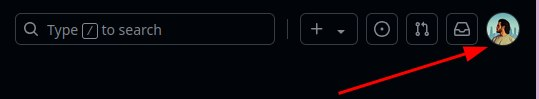
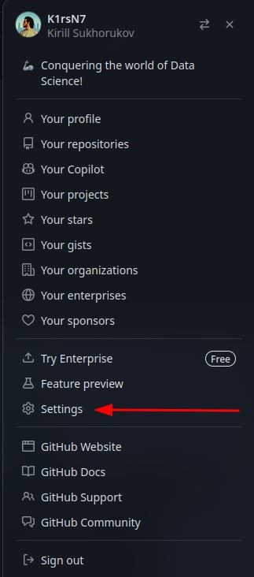
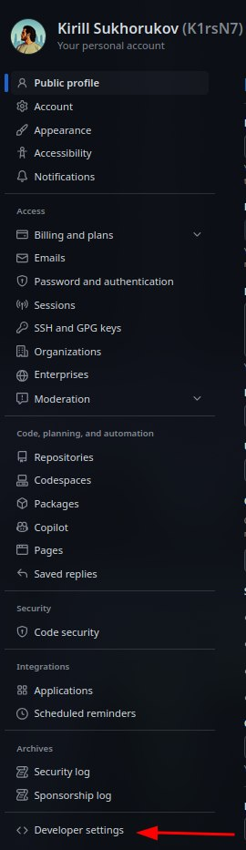
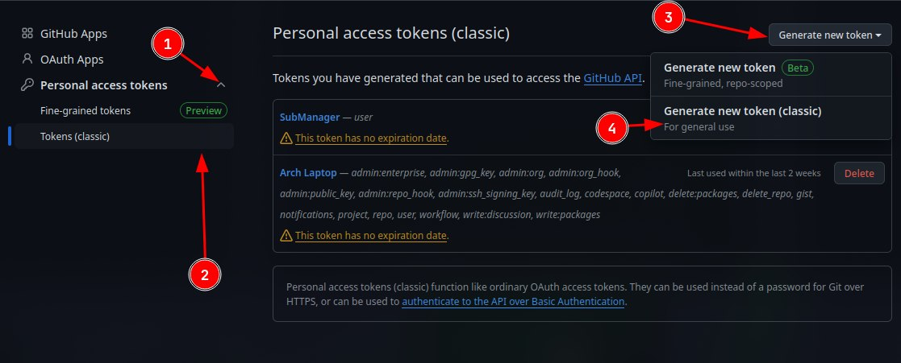
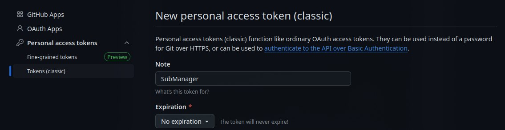
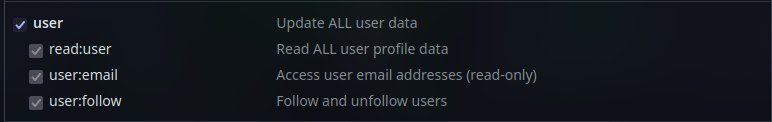
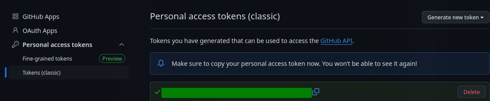

<h1 align="center">Documentation for Creating a GitHub Personal Access Token</h1>

The GitHub personal access token allows you to manage repositories and subscriptions without the need to enter a password. This token is a secure method of authentication and provides access to the GitHub API. This documentation outlines the steps for creating and using a personal access token.

<h2 align="center">Step 1: Log in to Your GitHub Account</h2>
<ol>
<li>Go to the GitHub website and log in to your account.</li>
<li>Make sure your email address is verified.</li>
</ol>

<h2 align="center">Step 2: Access Developer Settings</h2>
<ol>
<li>Click on your avatar in the upper right corner of the screen.

</li>
<li>Select Settings from the dropdown menu.

</li>
<li>Scroll down in the left sidebar to the Developer settings section.

</li>
</ol>

<h2 align="center">Step 3: Create a Personal Access Token</h2>
<ol>
<li>In the Developer settings, select Personal access tokens.</li>
<li>In the subsection, choose Tokens (classic).</li>
<li>Click on the Generate new token button and then on Generate new token (classic).</li>
<li>If prompted, enter your account password.

</li>
</ol>

<h2 align="center">Step 4: Configure Your Token</h2>
<ol>
<li>In the Note field, enter a description for the token, such as "Token for managing subscriptions".</li>
<li>In the Expiration dropdown, select a token expiration (it is recommended to choose No expiration).</li>
<li>Click on the Generate new token button and then on Generate new token (classic).

</li>
<li>Select the necessary permissions for the token, specifically include user (Update ALL user data).

</li>
</ol>

<h2 align="center">Step 5: Generate and Save Your Token</h2>
<ol>
<li>Scroll to the bottom of the page and click on the Generate token button.

</li>
<li>Copy the generated token and save it in a secure place, as it will only be shown once.

</li>
</ol>

<h2 align="center">Conclusion</h2>

Congratulations! You have successfully created a GitHub personal access token. Now you have all the necessary tools to manage your repositories and subscriptions with secure authentication. The token allows you to interact with the GitHub API, automate processes, and enhance your productivity.

Remember to keep your token in a safe place and only share it with those you trust. If you have any questions or need further assistance, feel free to refer to the GitHub documentation or reach out to the developer community.

