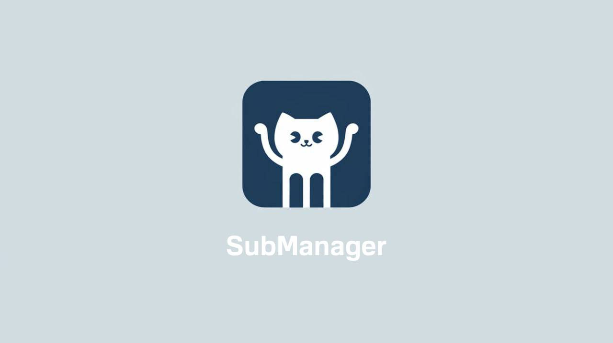

	
    <h1>Follow to those who Follow to you!</h1>

<h2 align="center">Project Description</h2>

GitFollowManager is a powerful and user-friendly Python tool designed to automate the management of followers and subscriptions on GitHub. In today's world where audience interaction is key, it's important to keep your follows up to date and reflect changes in your network of contacts.

With GitFollowManager, you can automatically follow users who have followed you and unfollow those who no longer follow you. This makes it easier to keep your follow list current and lets you focus on engaging with your audience instead of repetitive maintenance tasks.

GitFollowManager's key features include:

<ul>
    <li><strong>Cross-platform:</strong> The script is written in Python and runs on a variety of operating systems including Windows, macOS and Linux, making it accessible to a wide audience.</li>
    <li><strong>Automatic Subscription:</strong> The script automatically subscribes to all users who have subscribed to your account, so you don't miss out on new subscribers.</li>
    <li><strong>Automatic unsubscribe:</strong> You can easily unsubscribe users who have unsubscribed from you, which helps keep your subscription list clean.</li>
    <li><strong>Exceptions to the algorithm:</strong> GitFollowManager provides the ability to use two files: <code>ban_list_followers.txt</code> and <code>ban_list_following.txt</code>. These files allow you to add users to a blacklist, excluding them from automatic follows and unfollows, giving you complete control over who you want to leave out of the automated process.</li>
</ul>
<h2 align="center">Installation</h2>
<ol>
    <li><strong>Clone the repository:</strong>
        <pre><code>git clone https://github.com/mahmudnibir/GitFollowManager.git
cd GitFollowManager</code></pre>
    </li>
    <li><strong>Customize the file <code>config.json</code>:</strong>
    
Open the <code>config.json</code> file and change the following fields to your own:

    <pre><code>{
    "USERNAME": "Your username", 
    "TOKEN": "Your token",
    "PROMOTION": true,
    "DAYS_PERIOD": 3,
    "COUNT_PROMOTION_USERS": 500,
    "RETRY_ON": true
}
</code></pre>
    
If you are unsure how to generate a personal access token, please refer to the documentation at <a href="./Docs/Generate Token.md">Generate Token.md</a> for detailed instructions.

</li>

</ol>

<h2 align="center">Running the program</h2>

To run the program manually, run the following command in the terminal:

<pre><code>python3 main.py</code></pre>

<h2 align="center">Startup automation</h2>

To automate the launch of the GitFollowManager script, follow these steps depending on your operating system:

<h3>For Linux or macOS</h3>
<ol>
    <li>Open crontab for editing:
        <pre><code>sudo crontab -e</code></pre>
    </li>
    <li>Add the following line to the crontab file:
        <pre><code>0 */2 * * * /usr/bin/python3 GLOBAL_PATH/main.py</code></pre>
        
Replace <code>GLOBAL_PATH</code> to the full path to the <code>main.py</code> file.

    </li>
    <li>Save your changes and exit the editor.</li>
</ol>

<h3>For Windows</h3>
<ol>
    <li><strong>Open the Task Scheduler:</strong>
        <ul>
            <li>Press <strong>Windows + R</strong>, then type <code>taskschd.msc</code> and press Enter.</li>
        </ul>
    </li>
    <li><strong>Create a new task:</strong>
        <ul>
            <li>In the right pane, select <strong>Create Task</strong>.</li>
        </ul>
    </li>
    <li><strong>Configure the general settings:</strong>
        <ul>
            <li>Enter the name of the task and a description.</li>
            <li>Make sure that the correct version of Windows is selected in the <strong>Configuration for</strong> field.</li>
        </ul>
    </li>
    <li><strong>Set Trigger:</strong>
        <ul>
            <li>Go to the <strong>Triggers</strong> tab and click <strong>Create</strong>.</li>
            <li>Select <strong>Schedule</strong>.</li>
            <li>Set the frequency to <strong>Every 2 hours</strong>. To do this, you can select “Daily” and then specify the execution interval.</li>
        </ul>
    </li>
    <li><strong>Customize the action:</strong>
        <ul>
            <li>Go to the <strong>Actions</strong> tab and click <strong>Create</strong>.</li>
            <li><strong>Select Run Program</strong>.</li>
            <li>
<strong>In the “Program or Script”</strong> field, specify the path to the Python interpreter, for example:

                <pre><code>C:\Path\To\Python\python.exe</code></pre></li>
            <li>
<strong>In the “Arguments”</strong> field, specify the path to your script:

                <pre><code>C:\Path\To\Your\Script\main.py</code></pre></li>
        </ul>
    </li>
    <li><strong>Save the task:</strong>
        <ul>
            <li>
Click “OK” to save the task settings.
</li>
        </ul>
    </li>
</ol>

<h2 align="center">License</h2>

This project is licensed under the <a href=“./LICENSE”>MIT License</a>. The MIT License is one of the most popular and simple open source licenses. It allows you to:

<ul>
    <li><strong>Use:</strong> You can use the project code in your own projects, whether personal or commercial.</li>
    <li><strong>Modify:</strong> You can modify the project code, adapting it to your needs or improving functionality.</li>
    <li><strong>Distribute:</strong> You can distribute the original code or your own modifications, and you must specify the authorship of the original project.</li>
</ul>

It is important to note that the license does not provide any warranty, and the authors are not responsible for any problems that may occur when using the code.

<h2 align="center">Contacts</h2>

If you have any questions, suggestions or would like to discuss the project, please contact me on Discord: <strong>yuzitoshi</strong>, or by email at <a href="mailto:nibirbbkr@gmail.com">nibirbbkr@gmail.com</a> (or <a href="mailto:mahmudnibir@proton.me">mahmudnibir@proton.me</a>).

I'm always happy to hear feedback and suggestions for improving the project. Your support and ideas will help me make GitFollowManager even better!

<h2 align="center"> Star History</h2>
<a href="https://star-history.com/#mahmudnibir/GitFollowManager&Date">
 <picture>
     <source media="(prefers-color-scheme: dark)" srcset="https://api.star-history.com/svg?repos=mahmudnibir/GitFollowManager&type=Date&theme=dark" />
     <source media="(prefers-color-scheme: light)" srcset="https://api/star-history.com/svg?repos=mahmudnibir/GitFollowManager&type=Date" />
     
 </picture>
</a>
